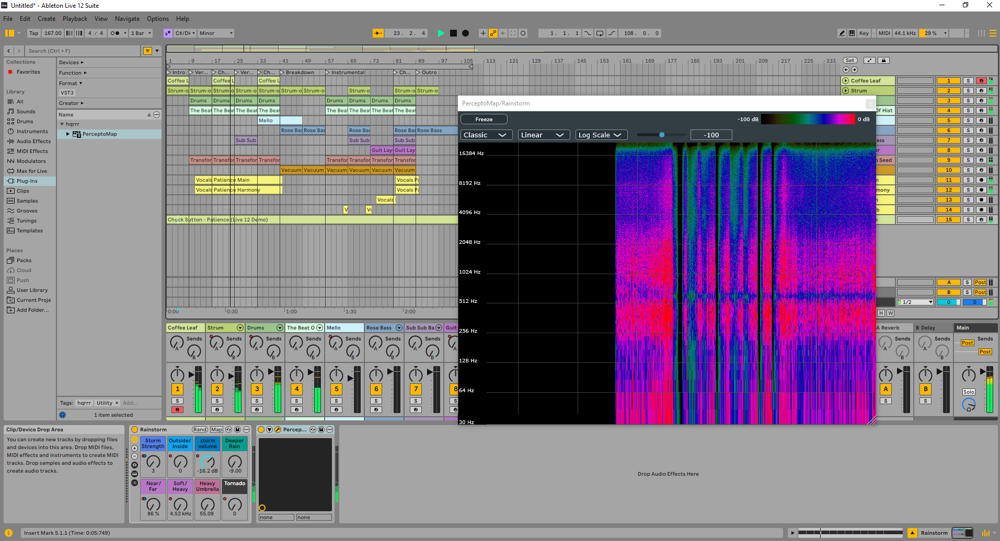
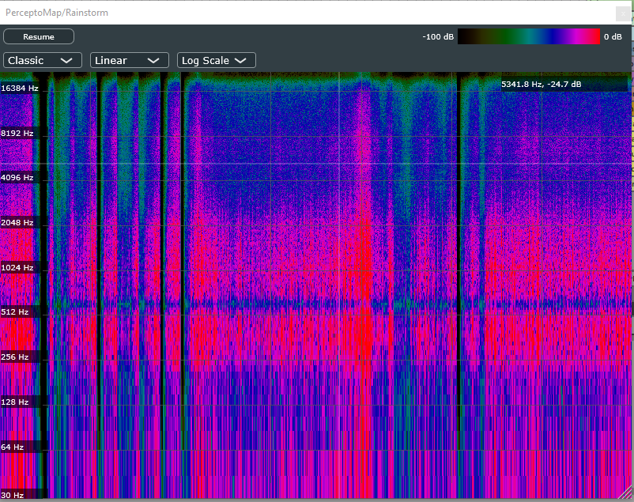
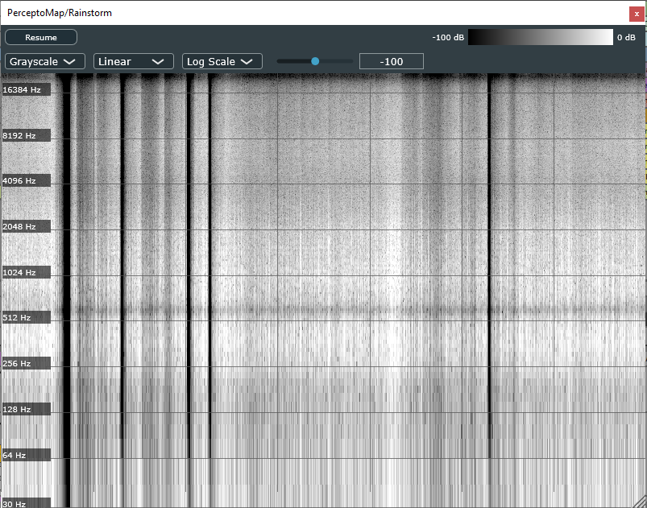
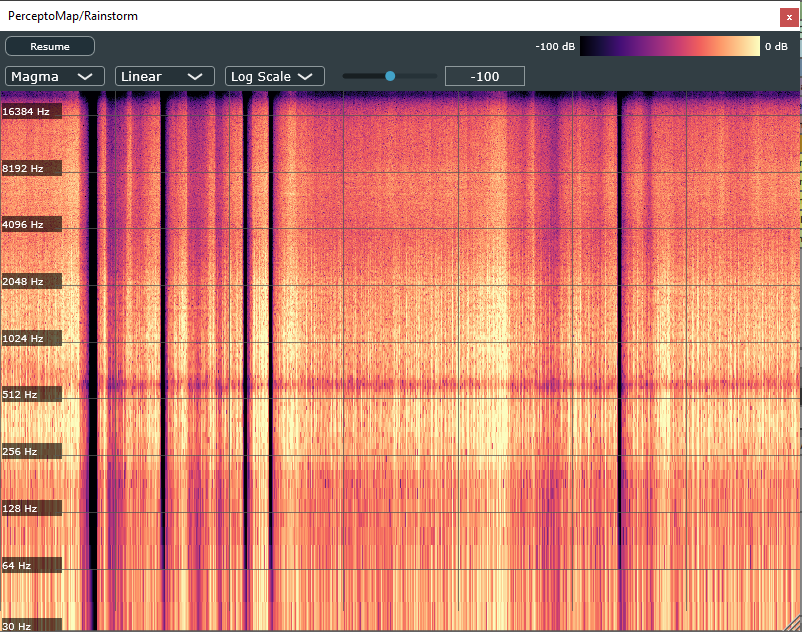
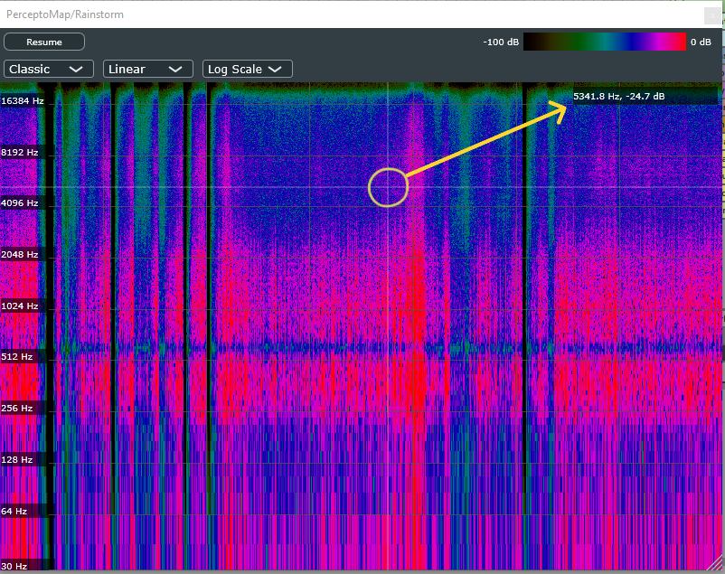
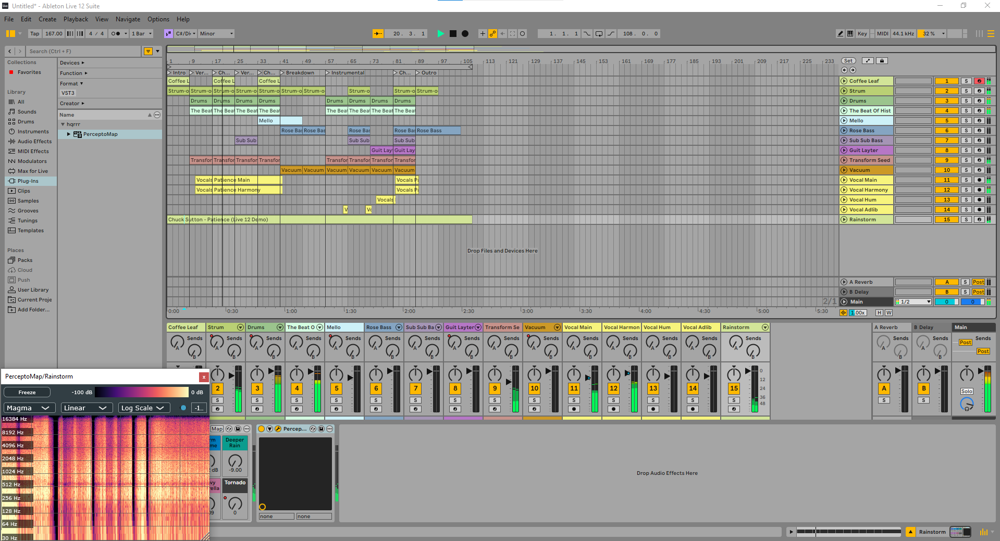
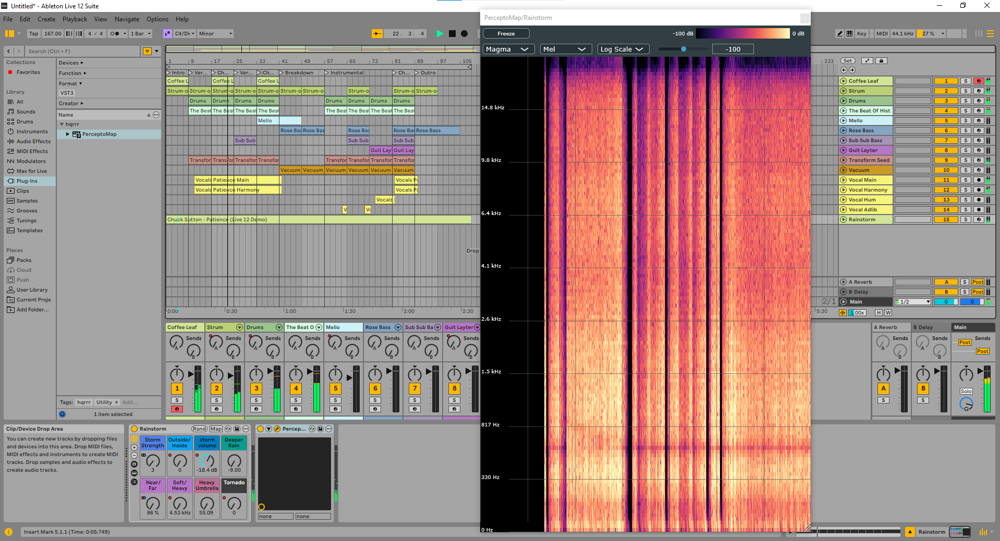
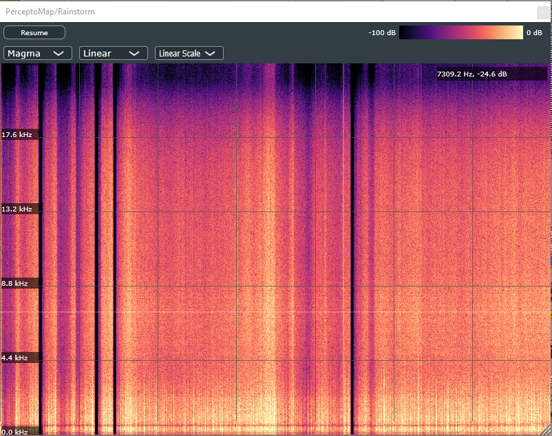
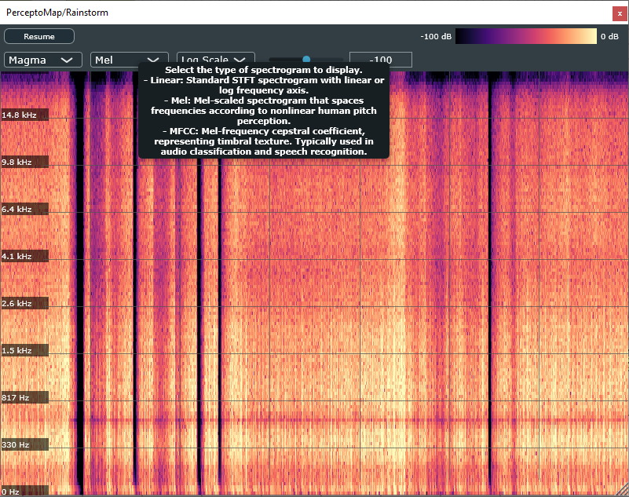

# PerceptoMap

**Visualizing how we hear — from spectrograms to perception**

PerceptoMap is an open-source audio plugin (VST3) that visualizes psychoacoustic features of audio signals in real time. Built with [JUCE](https://juce.com/), it's designed to help you **see** how we **perceive** sound — not just how it looks on a frequency plot.

Unlike typical spectrum or spectrogram analyzers, it supports perceptual visualizations such as **Mel spectrograms**, and (soon) **MFCCs**, **Chroma**, **Tempogram** etc., offering insight into how humans perceive sound.

> 🎧 If you're the kind of creator who trusts your ears above all — you might not need this.  
> But if you're curious about how your audio *measures up* to what humans actually hear… welcome aboard.

## Features

- Real-time **Mel Spectrogram** display with perceptual frequency scaling  
- Visual analysis of **MFCCs**, **Chroma**, **Tempogram**, and other psychoacoustic features *(planned)*  
- Configurable color maps
- Optional dB scaling, log or linear frequency axis for classic linear STFT spectrogram
- Freeze frame mode and interactive mouse hover to inspect frequency and loudness at any point

## Screenshots

<p align="center">
  
  <sub>Plugin User Interface in Ableton Live 12</sub>
</p>

---

<table>
  <tr>
    <td align="center" valign="top">
      
      <br/>
      <sub><strong>Classic</strong><br/>Default high-contrast mapping</sub>
    </td>
    <td align="center" valign="top">
      
      <br/>
      <sub><strong>Grayscale</strong><br/>Neutral luminance-based display</sub>
    </td>
    <td align="center" valign="top">
      
      <br/>
      <sub><strong>Magma</strong><br/>Perceptually uniform, dark background</sub>
    </td>
  </tr>
</table>

---

<p align="center">
  
  <sub><strong>Hover Readout</strong><br/>Displays precise frequency and dB level under the mouse pointer</sub>
</p>

---

<table>
  <tr>
    <td align="center" valign="top">
      
      <br/>
      <sub><strong>Resizable GUI</strong><br/>Window can shrink to fit minimal layout</sub>
    </td>
    <td align="center" valign="top">
      
      <br/>
      <sub><strong>Resizable GUI</strong><br/>Window expands for detailed viewing</sub>
    </td>
  </tr>
</table>

---

<table>
  <tr>
    <td align="center" valign="top">
      
      <br/>
      <sub>Linear STFT spectrogram with <strong>linear</strong> frequency axis</sub>
    </td>
    <td align="center" valign="top">
      
      <br/>
      <sub>Linear STFT spectrogram with <strong>log</strong> frequency axis</sub>
    </td>
    <td align="center" valign="top">
      
      <br/>
      <sub><strong>Mel-scaled</strong> STFT spectrogram</sub>
    </td>
  </tr>
</table>


## Roadmap

| Feature | Status | Description | Implementation Details |
|-|-|-|-|
| Linear STFT Spectrogram | ✅ Done | Classic time–frequency analysis | FFT size = 2048, Hann window, with log/linear frequency axis display|
| Mel-Spectrogram | ✅ Done | Nonlinear frequency scaling approximating human pitch perception | 128 bands, Slaney-style: `2595 * log10(1 + f / 700)`|
| MFCC | ⏳ Planned | Mel frequency cepstral coefficients, compact representation of timbre based on perceptual log-mel spectrum | - |
| Chroma | ⏳ Planned | Pitch class mapping, projection of spectral energy onto 12 pitch classes (C, C#, D…) | - |
| Tempogram / Rhythm Map | ⏳ Planned | Visualizes perceived tempo and rhythmic periodicities over time | - |
| Spectral centroid / flatness | ⏳ Planned | Measures of brightness and tonal clarity in the spectrum | - |


## Why develop this plugin?

In the fields of psychoacoustics, and machine learning, perceptually inspired representations such as **Mel spectrograms** and **MFCCs** are widely used — for example, in music genre classification, emotion recognition, or detecting AI-generated audio.  

As a frequent user of tools like [librosa](https://librosa.org/) in Python, while learning about DAWs, I was surprised to find that most DAWs seem to lack real-time, perceptually grounded visualization tools.  

So I decided to build one — a lightweight, JUCE-based plugin that brings these powerful analysis tools directly into the DAW environment, where musicians, sound designers, and researchers can explore them interactively.


## How to install?

You can download the latest version of **PerceptoMap** from the [Releases](https://github.com/hqrrr/PerceptoMap/releases) page.

### Available Format

- VST3 (`.vst3`)

### Plugin installation paths

#### Windows
1. Download the plugin `.zip` file from the [Releases](https://github.com/hqrrr/PerceptoMap/releases)
2. Unzip the file
3. Copy `.vst3` **plugin folder** to the default system VST3 directory: `C:\Program Files\Common Files\VST3\`
    
> Note: If you use a custom VST3 plugin path, copy it there instead.

4. Launch your DAW and run a plugin rescan if necessary
5. Then, you should be able to find the plugin under `hqrrr - PerceptoMap`

#### macOS

Not yet prebuilt — If you're a developer or familiar with JUCE/Xcode, please build from source, see instructions for developers below.

> After installation, restart your DAW and run a plugin rescan if needed.

## Build Instructions for Developers

### Prerequisites

- JUCE 8.x (open-source under AGPLv3)
- C++17 compatible compiler
- Projucer (included in JUCE)

### Build with Projucer

1. Open `PerceptoMap.jucer` in **Projucer**
2. Click **Save Project and Open in IDE** (Visual Studio, Xcode, etc.)
3. Build the target for your desired format (VST3, AU, AAX etc. which you selected in Projucer setting)
4. The plugin binary will be placed in the build output directory

## Folder Structure

```text
PerceptoMap/
├── _pics/               -> Screenshots and images for documentation
├── Source/              -> Main plugin source code
├── Builds/              -> IDE-specific build files (Visual Studio, Xcode, etc.)
├── PerceptoMap.jucer    -> Projucer project file (JUCE-based build config)
├── README.md            -> Project documentation
└── LICENSE              -> AGPLv3 license file (required for JUCE open-source usage)
```

## License & Cost

**PerceptoMap** is proudly open-source and completely free to use, modify, and redistribute under the terms of the [GNU AGPLv3 License](LICENSE).

There are no hidden fees, paid versions, or limitations — the plugin is intended to be a community-driven tool for perceptual audio analysis and creative exploration.

I do **not** ask for donations — what matters more is your **feedback**, **feature ideas**, or even better: your **involvement in development**.

Ways you can contribute:

- 🐞 Report bugs or issues you encounter
- 💡 Suggest improvements or new perceptual features
- 🔧 Submit pull requests to improve code or documentation
- 📢 Share the plugin with others who may find it useful

---

**Feel free to leave a comment** — bug reports, feature ideas, or just thoughts are always welcome.  
