# PerceptoMap

[](https://github.com/hqrrr/PerceptoMap/releases)&nbsp;
[](https://github.com/hqrrr/PerceptoMap/releases)
&nbsp;
[](https://github.com/hqrrr/PerceptoMap/releases)&nbsp;
[](https://github.com/hqrrr/PerceptoMap/blob/main/LICENSE)&nbsp;
[](https://doi.org/10.5281/zenodo.16923138)

### Visualizing how we hear — from spectrograms to perception

PerceptoMap is an open-source audio plugin (VST3) that visualizes psychoacoustic features of audio signals in real time. Built with [JUCE](https://juce.com/), it's designed to help you **see** how we **perceive** sound — not just how it looks on a frequency plot.

Unlike typical spectrum or spectrogram analyzers, it supports perceptual visualizations such as **Mel spectrograms**, **Mel-frequency cepstral coefficients (MFCCs)**, **Chromagram**, and **Tempogram** etc., offering insight into how humans perceive sound.

> 🎧 If you're the kind of creator who trusts your ears above all — you might not need this.  
> But if you're curious about how your audio *measures up* to what humans actually hear… welcome aboard.

## Quick Navigation

- [Key Features](#key-features)
- [Screenshots](#screenshots)
- [Roadmap](#roadmap)
- [Why develop this plugin?](#why-develop-this-plugin)
- [How to install?](#how-to-install)
  - [Windows](#windows)
  - [macOS (Intel / Apple Silicon)](#macos-intel--apple-silicon)
  - [Linux](#linux)
- [Build Instructions for Developers](#build-instructions-for-developers)
- [License & Cost](#license--cost)
- [How to cite](#how-to-cite)

## Key Features

- Real-time **Mel Spectrogram** display with perceptual frequency scaling
- Real-time **Mel-frequency cepstral coefficients (MFCCs)** representing timbral texture and spectral envelope
- **Spectral Centroid** tracking to visualize spectral brightness (center of mass of STFT spectrum)
- **Chromagram** showing the energy distribution across the 12 pitch classes (C to B), regardless of octave. <span style="color: gray;">[added in v0.5]</span>
- **Spectral Contrast** measuring the ratio of spectral peaks to valleys across octave-spaced frequency bands — high contrast indicates clear harmonic/narrow-band signals, low contrast indicates broadband noise. Based on [[10.1109/ICME.2002.1035731](https://doi.org/10.1109/ICME.2002.1035731)]. <span style="color: gray;">[added in v0.15]</span>
- **Spectral Flatness** (Wiener entropy): a single scalar per frame measuring how noise-like (close to 1.0) vs tone-like (close to 0.0) a sound is. Rendered as a height-proportional filled area chart with semantic tooltip. <span style="color: gray;">[added in v0.16]</span>
- **Spectral Rolloff** — cumulative energy threshold curves (R25/R50/R85/R95) overlaid on STFT spectrogram, tracking where different percentages of total spectral energy are concentrated. With toggleable curve visibility via clickable legend checkboxes. <span style="color: gray;">[added in v0.17]</span>
- **Time-Frequency Reassignment** mode (Linear+) for enhanced STFT resolution, based on the paper [[hal-00414583: Time-Frequency reassignment: from principles to algorithms](https://hal.science/hal-00414583/document)]. This mode sharpens the localization of spectral peaks by reassigning energy to more accurate time-frequency coordinates, making harmonic structures and transient details clearer compared to the standard STFT. <span style="color: gray;">[added in v0.6]</span>
- **Time-Frequency Reassigned Mel Spectrogram** mode (Mel+) - Mel-scaled display using the same time-frequency reassignment principle as Linear+. It computes the reassigned frequency from the complex STFT and then projects energy onto the Mel axis, yielding sharper harmonic ridges and crisper transients than a standard Mel spectrogram. <span style="color: gray;">[added in v0.7]</span>
- Real-time **Fourier Tempogram (with Tempo Line)** - Rhythm/tempo map in the BPM (frequency) domain with a dynamic tempo track, based on [[10.1109/ICASSP.2010.5495219](https://doi.org/10.1109/ICASSP.2010.5495219)]. <span style="color: gray;">[added in v0.10]</span>
- Visual analysis of **Autocorrelation Tempogram** — time-lag periodicity map robust to local phase, with dynamic Tempo Line. <span style="color: gray;">[added in v0.12]</span>
- Configurable color maps
- Adjustable brightness gain and enhanced colormap modes to improve visibility of fine details in the spectrogram <span style="color: gray;">[added in v0.4]</span>
- Optional dB scaling, log or linear frequency axis for classic linear STFT spectrogram
- Freeze frame mode and interactive mouse hover to inspect frequency and loudness at any point
- Configurable FFT size for balancing time resolution and frequency resolution.<span style="color: gray;">[added in v0.6]</span>
- Independent scroll speed control, allowing smooth visualization at different FFT sizes and overlap settings without distorting the spectral data. <span style="color: gray;">[added in v0.6]</span>
- Adjustable y-axis frequency range. <span style="color: gray;">[added in v0.8]</span>
- Global preset slots for quickly recalling frequently used visualization configurations. Presets are shared across projects and DAWs and can be overwritten via the Save button. Preset data is stored in a human-readable XML file on disk, allowing inspection or manual editing of preset values and names if needed. <span style="color: gray;">[added in v0.13]</span>
  - Windows: `%AppData%\PerceptoMap\PerceptoMapPresets.xml`
  - macOS: `~/Library/Application Support/PerceptoMap/PerceptoMapPresets.xml`
  - Linux: `~/.config/PerceptoMap/PerceptoMapPresets.xml`

  > **Note:** Editing the XML file while the plugin or DAW is running is not recommended. Changes should be made while the plugin is closed.


## Screenshots

<!-- <p align="center">
  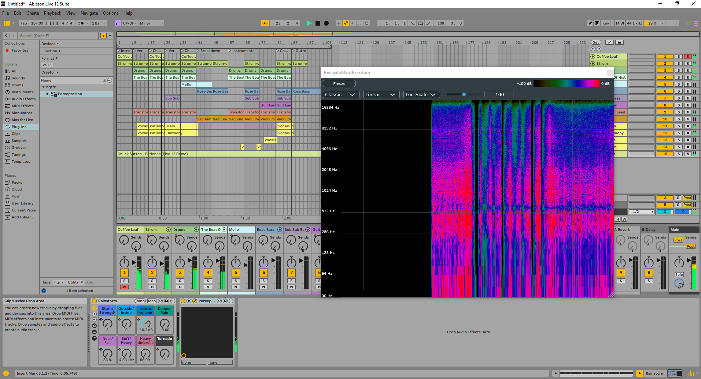
  <sub>Plugin User Interface in Ableton Live 12</sub>
</p>

--- -->

<table style="table-layout: fixed; width: 100%;">
  <tr>
    <td align="center" valign="top">
      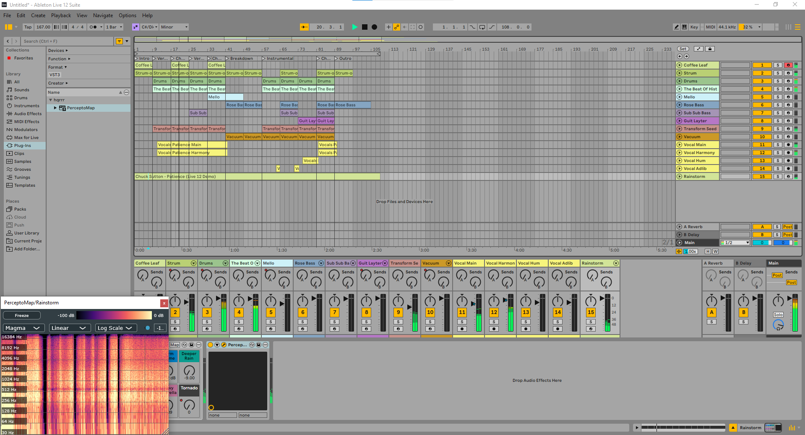
      <br/>
      <sub><strong>Resizable GUI</strong><br/>Window can shrink to fit minimal layout</sub>
    </td>
    <td align="center" valign="top">
      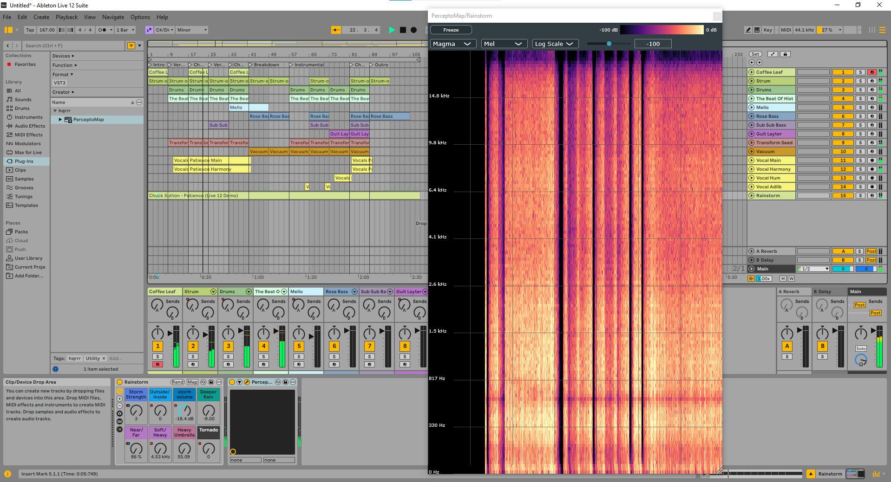
      <br/>
      <sub><strong>Resizable GUI</strong><br/>Window expands for detailed viewing</sub>
    </td>
  </tr>
</table>

---

<table>
  <tr>
    <td align="center" valign="top">
      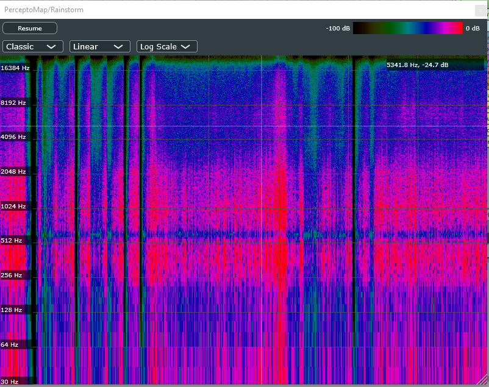
      <br/>
      <sub><strong>Classic</strong><br/>Default high-contrast mapping</sub>
    </td>
    <td align="center" valign="top">
      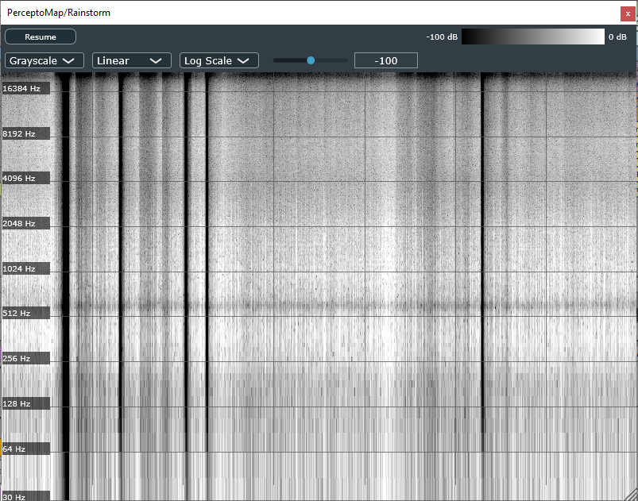
      <br/>
      <sub><strong>Grayscale</strong><br/>Neutral luminance-based display</sub>
    </td>
    <td align="center" valign="top">
      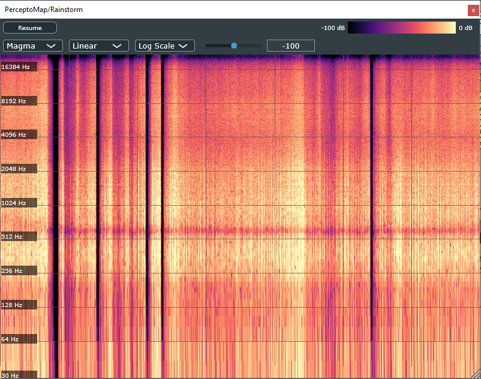
      <br/>
      <sub><strong>Magma</strong><br/>Perceptually uniform, dark background</sub>
    </td>
  </tr>
</table>

---

<table style="table-layout: fixed; width: 100%;">
  <tr>
    <td align="center" valign="top">
      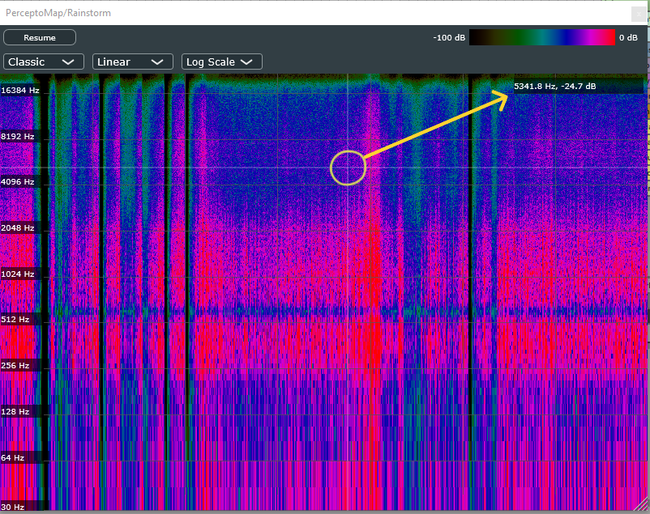
      <sub><strong>Hover Readout</strong><br/>Displays precise frequency, dB level, and corresponding MIDI note (C4 = Middle C) <span style="color: gray;">[added in v0.3]</span> under the mouse pointer.</sub>
    </td>
    <td align="center" valign="top">
      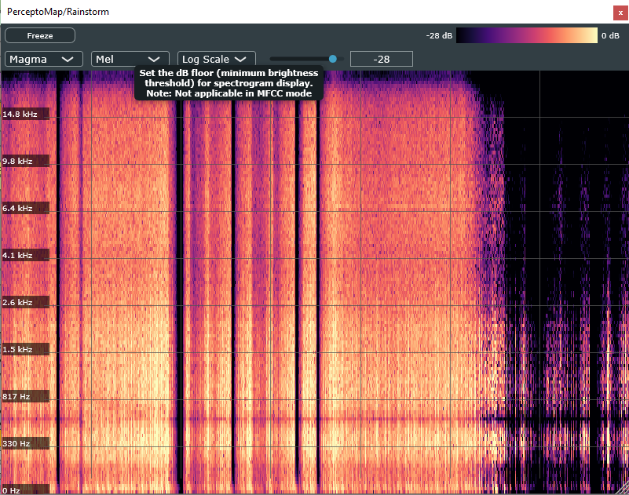
      <sub><strong>Adjustable dB Floor Slider</strong><br/>Controls the minimum dB threshold for color brightness, helping visualize low-level signals. <span style="color: gray;">[added in v0.3]</span></sub>
    </td>
  </tr>
</table>


---

<table style="table-layout: fixed; width: 100%;">
  <tr>
    <td align="center" valign="top">
      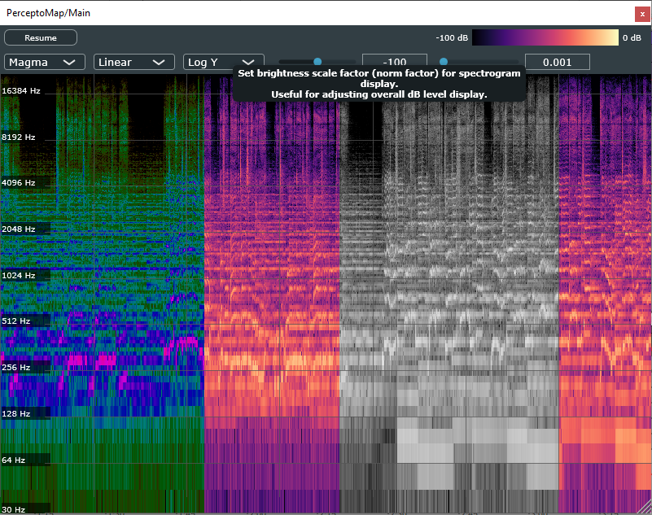
      <sub><strong>Adjustable Brightness Gain</strong><br/>The Norm Factor slider allows manual control over spectrogram brightness, helping to adapt the display to signals with different loudness levels. <span style="color: gray;">[added in v0.4]</span></sub>
    </td>
    <td align="center" valign="top">
      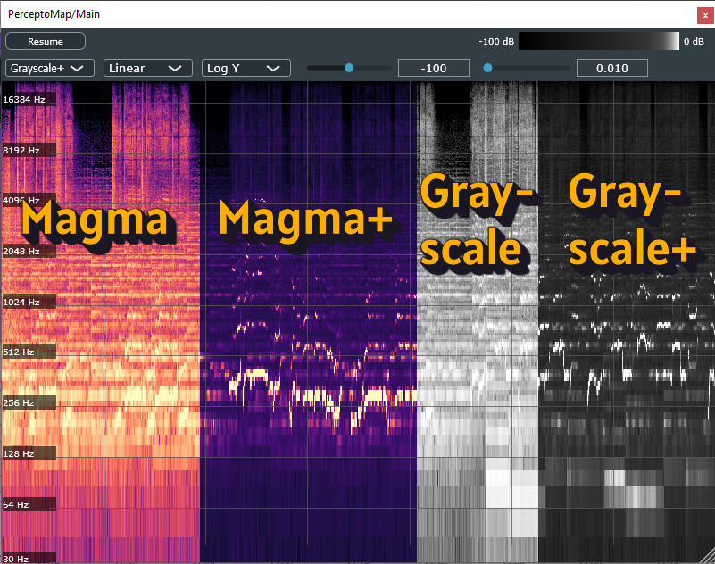
      <sub><strong>Fine Detail with Enhanced Colormap Modes</strong><br/>With non-linear color legend to enhance contrast, making subtle details more visible: <i>Magma+ & Grayscale+</i>. <span style="color: gray;">[added in v0.4]</span></sub>
    </td>
    <td align="center" valign="top">
      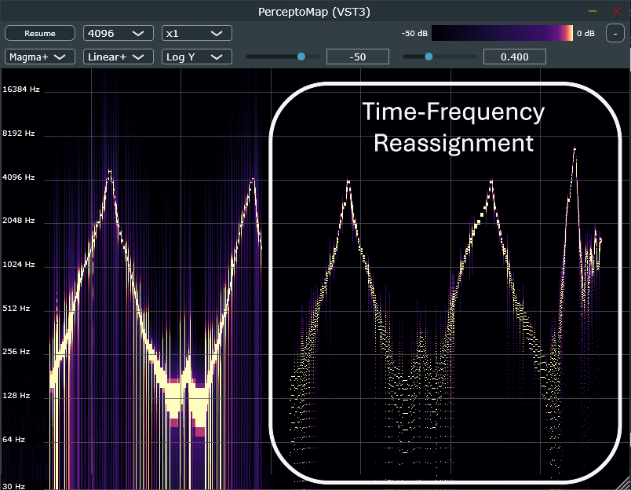
      <sub><strong>Linear+/Mel+: Time–Frequency Reassignment Mode</strong><br/>
      Sharpens the time–frequency localization of spectral peaks by reassigning energy to more accurate coordinates. Harmonic structures and transients become more clearly defined, compared to standard STFT. <span style="color: gray;">[added in v0.6/v0.7]</span></sub>
    </td>
  </tr>
</table>

---

<table style="table-layout: fixed; width: 100%;">
  <tr>
    <td align="center" valign="top">
      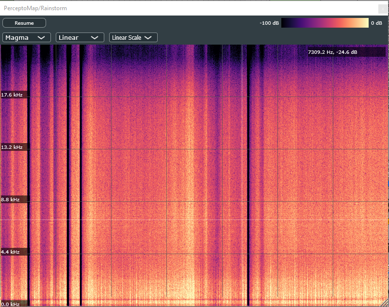
      <br/>
      <sub>
        <strong>Linear STFT spectrogram with linear frequency axis:</strong>
        <i>
          Displays physical frequency content directly.
        </i>
      </sub>
    </td>
    <td align="center" valign="top">
      
      <br/>
      <sub>
        <strong>Linear STFT spectrogram with log frequency axis:</strong>
        <i>
          Approximates human pitch perception. Emphasizes low-frequency resolution and compresses high-frequency bands.
        </i>
      </sub>
    </td>
    <td align="center" valign="top">
      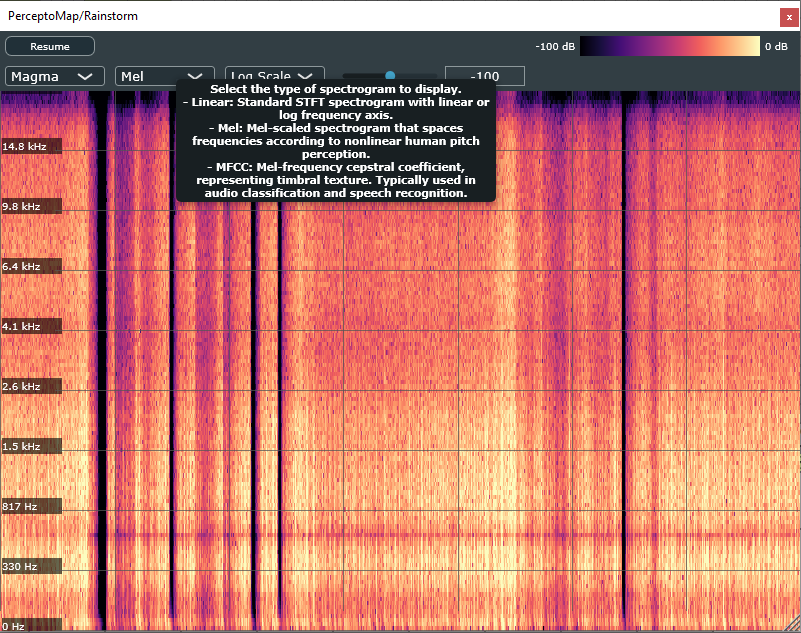
      <br/>
      <sub>
        <strong>Mel-scaled STFT spectrogram:</strong>
        <i>
          Reflects the nonlinear frequency resolution of human hearing. Provides a more perceptually accurate representation than simple log-scaling.
        </i>
      </sub>
    </td>
  </tr>
</table>

<table style="table-layout: fixed; width: 100%;">
  <tr>
    <td align="center" valign="top">
      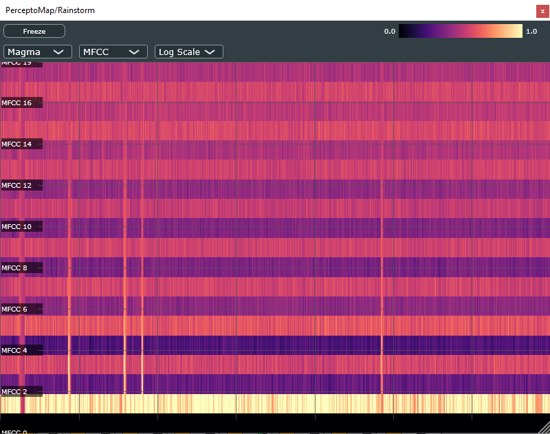
      <br/>
      <sub>
        <strong>Mel-frequency cepstral coefficients (MFCCs):</strong>
        <i>
          Captures the spectral envelope using Discrete Cosine Transform (DCT) over Mel energies. Represents timbral texture and vocal tract shape. <span style="color: gray;">[added in v0.2]</span>
        </i>
      </sub>
    </td>
    <td align="center" valign="top">
      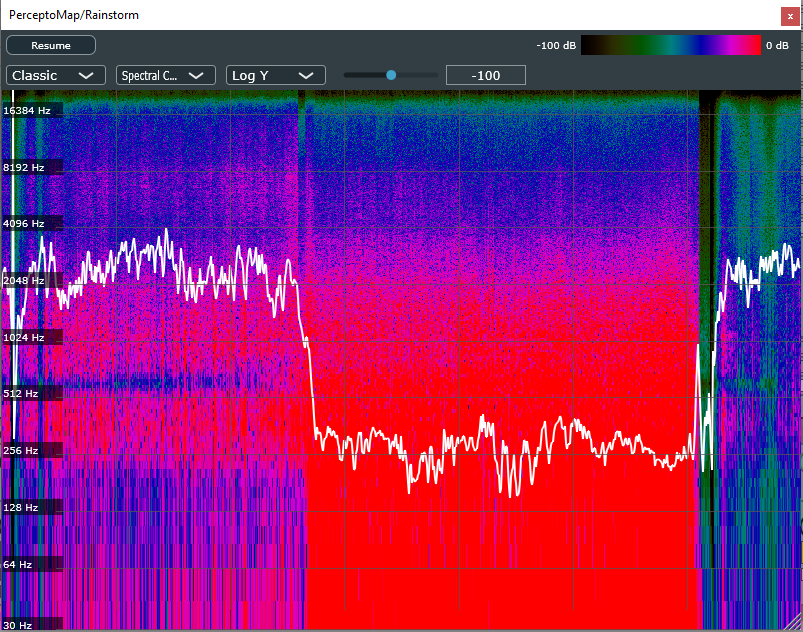
      <br/>
      <sub>
        <strong>Spectral Centroid:</strong>
        <i>
          Indicates the "center of mass" of the spectrum. Tracks brightness and perceptual sharpness by showing where the dominant frequencies are concentrated over time. <span style="color: gray;">[added in v0.3]</span>
        </i>
      </sub>
    </td>
    <td align="center" valign="top">
      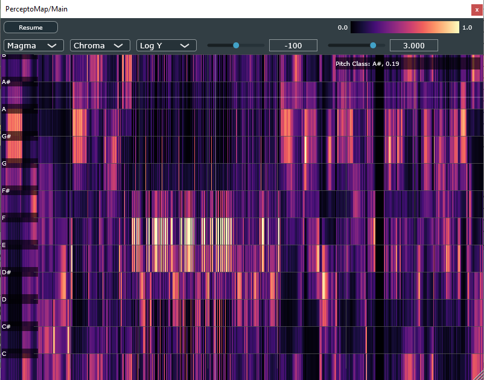
      <br/>
      <sub>
        <strong>Chromagram:</strong>
        <i>
          Projects spectral energy onto the 12 pitch classes (C, C#, D, …), regardless of octave. Useful for analyzing harmony, key, and chord structures. <span style="color: gray;">[added in v0.5]</span>
        </i>
      </sub>
    </td>
  </tr>
</table>

<table style="table-layout: fixed; width: 100%;">
  <tr>
    <td align="center" valign="top">
      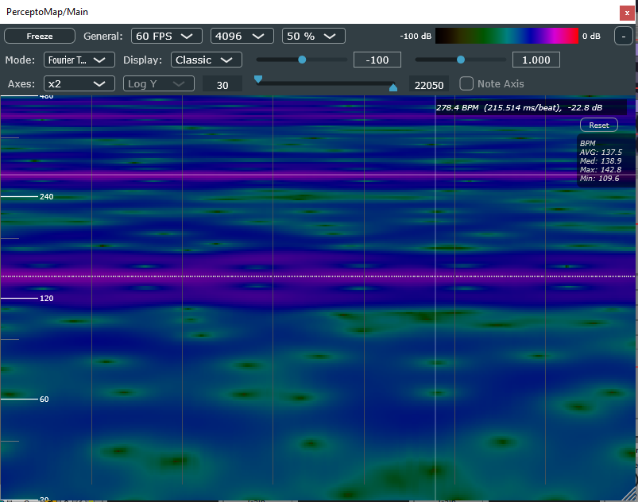
      <br/>
      <sub>
        <strong>Fourier Tempogram:</strong>
        <i>
          Rhythm/tempo map showing BPM energy over time, with dynamic tempo track. <span style="color: gray;">[added in v0.10]</span>
        </i>
      </sub>
    </td>
    <td align="center" valign="top">
      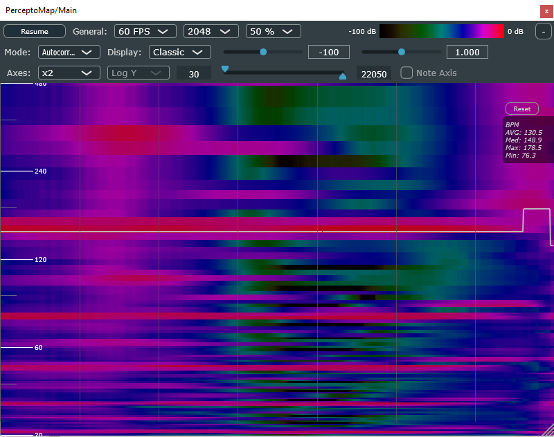
      <br/>
      <sub>
        <strong>Autocorrelation Tempogram:</strong>
        <i>
          Rhythm/tempo map from windowed autocorrelation of the onset/novelty signal, robust to phase; includes a dynamic tempo track <span style="color: gray;">[added in v0.12]</span>
        </i>
      </sub>
    </td>
    <td align="center" valign="top">
      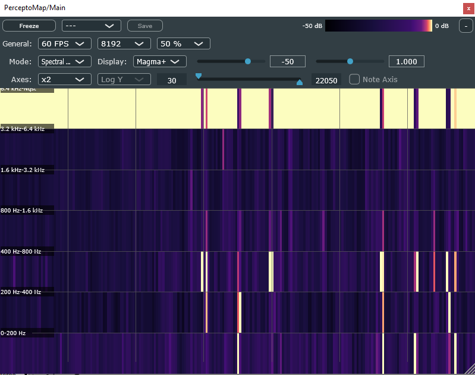
      <br/>
      <sub>
        <strong>Spectral Contrast:</strong>
        <i>
          Octave-band spectral contrast showing the ratio of peaks to valleys in each frequency band. Bright bands indicate strong harmonic content; dark bands indicate noise-like spectra. <span style="color: gray;">[added in v0.15]</span>
        </i>
      </sub>
    </td>
  </tr>
</table>

<table style="table-layout: fixed; width: 100%;">
  <tr>
    <td align="center" valign="top">
      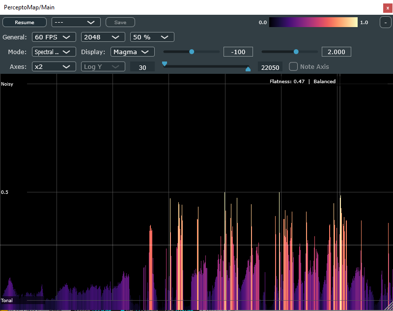
      <br/>
      <sub>
        <strong>Spectral Flatness:</strong>
        <i>
          Per-frame Wiener entropy visualized as a height-proportional filled area chart — fill height = flatness value. Warm colors indicate high flatness (noise-like), cool colors indicate low flatness (tonal). Y-axis: Tonal (0.0) to Noisy (1.0). <span style="color: gray;">[added in v0.16]</span>
        </i>
      </sub>
    </td>
    <td align="center" valign="top">
      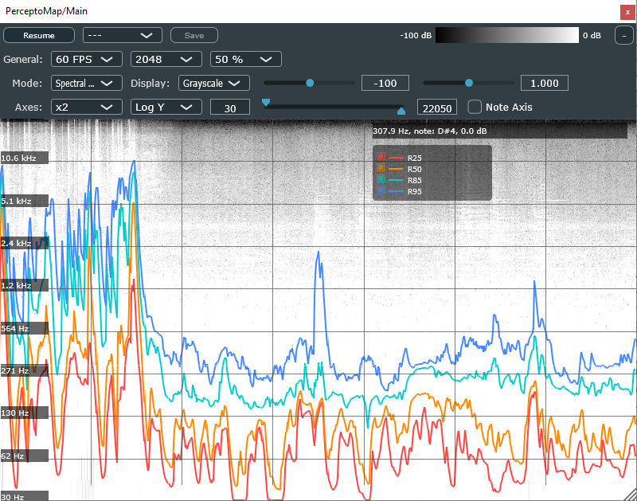
      <br/>
      <sub>
        <strong>Spectral Rolloff:</strong>
        <i>
          Four cumulative energy threshold curves (R25/red, R50/orange, R85/cyan, R95/blue) overlaid on STFT spectrogram. Tracks where different percentages of spectral energy are concentrated over time. Clickable legend checkboxes toggle individual curve visibility. <span style="color: gray;">[added in v0.17]</span>
        </i>
      </sub>
    </td>
    <td align="center" valign="top">
      
      <br/>
      <sub>
        <strong></strong>
        <i>
        </i>
      </sub>
    </td>
  </tr>
</table>

[Back to top ↥](#perceptomap)

## Roadmap

| Feature | Status | Description | Implementation Details |
|-|-|-|-|
| Linear STFT Spectrogram | ✅ Done (v0.1) | Classic time–frequency analysis | Hann window, with log/linear frequency axis display and adjustable FFT size & scroll speed [added in v0.6]|
| Mel-Spectrogram | ✅ Done (v0.1) | Nonlinear frequency scaling approximating human pitch perception | 128 bands, Slaney-style: `2595 * log10(1 + f / 700)`|
| MFCC | ✅ Done (v0.2) | Mel frequency cepstral coefficients, compact representation of timbre based on perceptual log-mel spectrum | DCT-II on log-mel spectrum, 20 coefficients, no liftering, values clipped to [−100, 100] and normalized to [0, 1] for display |
| Spectral Centroid (STFT-based) | ✅ Done (v0.3) | Tracks the "center of mass" of the spectrum; correlates with brightness and sharpness | Computed from linear STFT magnitude spectrum with smoothing (Exponential Moving Average), overlaid as a curve on the STFT spectrogram |
| Adjustable brightness gain and enhanced colormap modes | ✅ Done (v0.4) | To improve visibility of fine details in the spectrogram | Brightness remapped using non-linear scaling; norm factor slider controls global dB scaling, color maps applied after brightness normalization |
| Chroma | ✅ Done (v0.5) | Pitch class mapping, projection of spectral energy onto 12 pitch classes (C, C#, D…) | Triangular chroma filter bank built from STFT bins, 12 overlapping filters per octave; energy mapped to pitch classes regardless of octave; supports smooth pitch transitions and partial overlaps |
| Enhanced STFT with Time–Frequency Reassignment (Linear+) | ✅ Done (v0.6) | Sharper time–frequency localization by reassigning each STFT bin’s energy to more accurate time/frequency coordinates | Based on [[hal-00414583: Time-Frequency reassignment: from principles to algorithms](https://hal.science/hal-00414583/document)], implemented with Gaussian-window STFT and its time & frequency derivatives. Instantaneous frequency and group delay estimates are used to re-map spectral energy, improving localization of transients and harmonics compared to standard STFT. Supports same FFT size and log/linear axis options as Linear mode |
| Enhanced Mel Spectrogram with Time–Frequency Reassignment (Mel+) | ✅ Done (v0.7) | Mel-scaled spectrogram with sharper harmonic ridges and crisper transients by reassigning each STFT bins energy to its true instantaneous frequency, then projecting onto the Mel axis | Based on the same reassignment principle as Linear+. Mapped to Mel. |
| Y-axis Range Control | ✅ Done (v0.8) | Precise control over visible frequency band | Dual-handle range slider + editable min/max fields |
| Fourier Tempogram | ✅ Done (v0.10) | Rhythm/tempo map showing BPM energy over time, with dynamic tempo track (Tempo Line), sharper separation of nearby tempo | Based on [[10.1109/ICASSP.2010.5495219](https://doi.org/10.1109/ICASSP.2010.5495219)]. Positive spectral flux on log-compressed STFT; STFT of the novelty with a Hann window of length `wantWinSec` seconds (default: 8s); BPM axis sampled on a log scale. Per-frame prior-weighted peak picking (log-normal prior) overlays a continuous tempo line.<br/> **Note:** the tempogram and tempo line update with a delay = `wantWinSec` (window accumulation). On entering this mode the FFT size will be auto-bumped to >= 4096 for a more stable onset envelope. |
| Autocorrelation Tempogram | ✅ Done (v0.12) | Time-lag periodicity map (tempo strength over time, mapped to BPM) with dynamic Tempo Line, robust to local phase, naturally highlights double/half-time relationships | Similar to the Fourier Tempogram, but computed via windowed autocorrelation of the onset/novelty signal. The AutoCorrelation Function (ACF) is normalized by the zero-lag term; the BPM axis is log-spaced, and a per-frame log-normal prior guides peak picking to draw the Tempo Line. Note: entering this mode auto-sets FFT size to 2048 for improved temporal resolution. |
| Global Preset Slots | ✅ Done (v0.13) | Simple global preset management for frequently used visualization configurations | Three editable preset slots stored globally (shared across projects and DAWs). Presets can be overwritten via the Save button; switching presets immediately applies the stored configuration. Presets are persisted as a human-readable XML file, allowing manual inspection and editing by advanced users. |
| Spectral Contrast | ✅ Done (v0.15) | Octave-band spectral contrast: ratio of spectral peaks to valleys per frequency band | Divides FFT magnitude bins into `nBands+1` octave-spaced frequency bands (first band: [0, `fmin`=200 Hz], then octave doublings: [200, 400], [400, 800], … up to Nyquist). Per band: sorts magnitudes, computes peak (mean of top `quantile`=2%) and valley (mean of bottom 2%); contrast = `log10(peak) − log10(valley)`, normalized to [0,1] for display. Follows the librosa convention (direct log difference) rather than the paper's original `ln(1+peak)−ln(1+valley)` formulation. Based on [[10.1109/ICME.2002.1035731](https://doi.org/10.1109/ICME.2002.1035731)]. |
| Spectral Flatness | ✅ Done (v0.16) | Wiener entropy per frame: geometric mean / arithmetic mean of spectrum, measuring how noise-like vs tone-like a sound is | Computed in log-domain for numerical stability: `flatness = exp(mean(log(mags+eps))) / mean(mags)`. DC bin skipped (`i=1`). Silence guard returns `0.0`. Rendered as height-proportional filled area chart. |
| Spectral Rolloff | ✅ Done (v0.17) | Frequency threshold below which X% of total spectral energy is contained, with 4 configurable curves (R25/R50/R85/R95) overlaid on STFT | Cumulative energy threshold from linear STFT magnitude spectrum (DC bin excluded); 4 independent EMA-smoothed curves with warm to cool gradient; clickable legend checkboxes toggling individual curve visibility |
| Onset Detection Markers | ⏳ Planned | Transient markers overlaid on spectrogram | - |
| Constant-Q Transform (CQT) Spectrogram | ⏳ Planned | Log-spaced, pitch-aligned filterbank replacing FFT | - |
| Harmonic-Percussive Source Separation (HPSS) | ⏳ Planned | Median-filter based decomposition of spectrogram into harmonic and percussive components | - |

[Back to top ↥](#perceptomap)

## Why develop this plugin?

In the fields of psychoacoustics, and machine learning, perceptually inspired representations such as **Mel spectrograms** and **MFCCs** are widely used — for example, in music genre classification, emotion recognition, or detecting AI-generated audio.  

As a frequent user of tools like [librosa](https://librosa.org/) in Python, while learning about DAWs, I was surprised to find that most DAWs seem to lack real-time, perceptually grounded visualization tools.  

So I decided to build one — a lightweight, JUCE-based plugin that brings these powerful analysis tools directly into the DAW environment, where musicians, sound designers, and researchers can explore them interactively.

[Back to top ↥](#perceptomap)

## How to install?

You can download the latest version of **PerceptoMap** from the [Releases](https://github.com/hqrrr/PerceptoMap/releases) page.

### Available Format

- VST3 (`.vst3`)

### Plugin installation paths

#### Windows
1. Download the plugin `.zip` file from the [Releases](https://github.com/hqrrr/PerceptoMap/releases)
2. Unzip and copy `.vst3` **plugin folder** to the default system VST3 directory: `C:\Program Files\Common Files\VST3\`

> Note: If you use a custom VST3 plugin path, copy it there instead.

3. Launch your DAW and run a plugin rescan if necessary
4. Then, you should be able to find the plugin under `hqrrr - PerceptoMap`

#### macOS (Intel / Apple Silicon)

1. Download the plugin `.zip` file from the [Releases](https://github.com/hqrrr/PerceptoMap/releases):
   - `macOS_x64` for Intel
   - `macOS_arm` for Apple Silicon
2. Unzip and copy the `.vst3` **plugin folder** to the default system VST3 directory:  
   `/Library/Audio/Plug-ins/VST3`

> Note: If you use a custom VST3 plugin path, copy it there instead.

3. Launch your DAW and rescan plugins if needed
4. Then, you should be able to find the plugin under `hqrrr - PerceptoMap`

#### Linux
1. Download the plugin `.zip` file from the [Releases](https://github.com/hqrrr/PerceptoMap/releases)
2. Unzip and copy `.vst3` **plugin folder** to your VST3 directory
3. Launch your DAW and rescan plugins if needed
4. Then, you should be able to find the plugin under `hqrrr - PerceptoMap`

[Back to top ↥](#perceptomap)

## Build Instructions for Developers

### Prerequisites

- JUCE 8.x (automatically fetched via CMake)
- C++17 compatible compiler, e.g. Visual Studio 2022 (Windows)
- CMake 3.22+

### Build with CMake

Based on [JUCE CMake Plugin Template](https://github.com/anthonyalfimov/JUCE-CMake-Plugin-Template).

#### On Windows (Visual Studio 2022)

1. Open the project root in Visual Studio (choose "Open a local folder").
2. Visual Studio will automatically detect the CMakeLists.txt.
3. Select a CMake target configuration (e.g. x64-Release).
4. In the CMake Targets View: `PerceptoMap/PerceptoMap Project/Targets`, right-click `PerceptoMap_VST3` and click Build.
5. The plugin binary will be placed in the build output directory: `out/build/x64-Release/VST3/PerceptoMap.vst3`

#### On Windows (Terminal)

```
cd path\to\PerceptoMap
cmake -B build -DCMAKE_BUILD_TYPE=Release
cmake --build build --config Release
```

If using Ninja

```
cmake -B build -G Ninja -DCMAKE_BUILD_TYPE=Release
cmake --build build
```

## Folder Structure

```text
PerceptoMap/
├── _pics/               -> Screenshots and images for documentation
├── Source/              -> Main plugin source code
├── CMakeLists.txt       -> Main build configuration (CMake-based)
├── CMakeSettings.json   -> (Optional) Visual Studio CMake config
├── README.md            -> Project documentation
└── LICENSE              -> AGPLv3 license file (required for JUCE open-source usage)
```

[Back to top ↥](#perceptomap)

## License & Cost

**PerceptoMap** is proudly open-source and completely free to use, modify, and redistribute under the terms of the [GNU AGPLv3 License](LICENSE).

There are no hidden fees, paid versions, or limitations — the plugin is intended to be a community-driven tool for perceptual audio analysis and creative exploration.

I do **not** ask for donations — what matters more is your **feedback**, **feature ideas**, or even better: your **involvement in development**.

Ways you can contribute:

- 🐞 Report bugs or issues you encounter
- 💡 Suggest improvements or new perceptual features
- 🔧 Submit pull requests to improve code or documentation
- 📢 Share the plugin with others who may find it useful

---

**Feel free to leave a comment** — bug reports, feature ideas, or just thoughts are always welcome.  

[Back to top ↥](#perceptomap)


## How to cite

If you use **PerceptoMap** in academic work, please cite a tagged release.

```bibtex
@software{PerceptoMap_Huang,
  author  = {Qirui Huang},
  title   = {PerceptoMap},
  subtitle= {VST3 spectrogram and psychoacoustic visualizer},
  version = {v0.15},
  date    = {2026},
  url     = {https://github.com/hqrrr/PerceptoMap},
  note    = {GitHub repository},
  doi     = {10.5281/zenodo.16923138}
}
```

> *Replace **version** (incl. release **date**) with the exact version you used.*

[Back to top ↥](#perceptomap)

## Star History

[](https://www.star-history.com/#hqrrr/PerceptoMap&Date)
